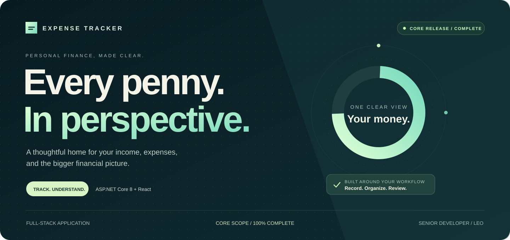
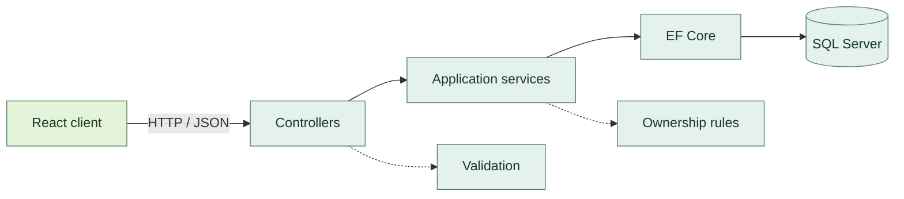

<a id="top"></a>

<div align="center">
  
  <br /><br />
  <a href="#english"><strong>ENGLISH</strong></a> &nbsp; / &nbsp; <a href="#persian"><strong>فارسی</strong></a>
  <br /><br />
  
  
  
  
  
</div>

<br />

<a id="english"></a>

# Expense Tracker

**Personal finance, with room to breathe.** Record your transactions, organize your spending, and understand your financial position through a focused React interface and a layered ASP.NET Core API.

<p>
<a href="#features">Explore features</a> &nbsp;·&nbsp;
<a href="#stack">Technology</a> &nbsp;·&nbsp;
<a href="#architecture">Architecture</a> &nbsp;·&nbsp;
<a href="#start">Quick start</a> &nbsp;·&nbsp;
<a href="#api">API reference</a> &nbsp;·&nbsp;
<a href="#developer">Meet Leo</a>
</p>

<br />


<br />

<a id="features"></a>

## 01 / A place for every transaction

<table>
<tr>
<td width="50%" valign="top">
<h3>↗ Income &amp; expenses</h3>
<p>Create, review, edit, and delete transactions. Keep your daily financial activity organized in one place.</p>
</td>
<td width="50%" valign="top">
<h3>⌕ Find what matters</h3>
<p>Search and filter by transaction type, category, and date range. Sort and paginate results on the server.</p>
</td>
</tr>
<tr>
<td valign="top">
<h3>◉ A clearer overview</h3>
<p>See income, expenses, balance, category summaries, monthly trends, and recent transactions.</p>
</td>
<td valign="top">
<h3>◇ Your personal space</h3>
<p>JWT authentication, BCrypt password hashing, request validation, and per-user ownership checks.</p>
</td>
</tr>
</table>

**Eight categories, ready from the start**

`Food` · `Transport` · `Shopping` · `Bills` · `Entertainment` · `Health` · `Salary` · `Other`

<a id="stack"></a>

## 02 / Built on a focused stack

| Layer | Foundation | Supporting tools |
|:---|:---|:---|
| **API** | ASP.NET Core 8 | FluentValidation · Swagger / OpenAPI |
| **Persistence** | Entity Framework Core 8 | SQL Server · Fixed-precision money values |
| **Interface** | React + Vite | Tailwind CSS · React Router |
| **Authentication** | JWT | BCrypt · Ownership checks |

<a id="architecture"></a>

## 03 / Clear responsibilities at every layer



Controllers handle HTTP requests, services apply business rules, and Entity Framework Core manages persistence. DTOs separate API contracts from database entities.

<a id="start"></a>

## 04 / From source to running locally

**Prerequisites:** .NET 8 SDK, Node.js with npm, SQL Server, and Git.

### Get the source

```bash
git clone https://github.com/here-is-leo/expense-tracker.git
cd expense-tracker
```

### Configure the API

Set the database connection and JWT values using .NET user secrets, environment variables, or local development settings. Example variable names:

```dotenv
ConnectionStrings__DefaultConnection=your-sql-server-connection-string
Jwt__Key=your-long-random-development-secret
Jwt__Issuer=ExpenseTracker.Api
Jwt__Audience=ExpenseTracker.Client
```

### Start the backend

```bash
cd backend/ExpenseTracker.Api
dotnet restore
dotnet ef database update
dotnet run
```

### Start the frontend

Open a second terminal at the repository root:

```bash
cd frontend
npm install
npm run dev
```

Set `VITE_API_BASE_URL` if required by your frontend configuration. Use the actual API address and ports shown by your local setup. Keep production credentials outside version control.

<a id="api"></a>

## 05 / A small, practical API

| Method | Endpoint | Purpose |
|:---|:---|:---|
| `POST` | `/api/auth/register` | Create an account |
| `POST` | `/api/auth/login` | Authenticate and receive a JWT |
| `GET` | `/api/transactions` | Search, filter, sort, and paginate |
| `POST` | `/api/transactions` | Create a transaction |
| `GET` | `/api/transactions/{id}` | Retrieve an owned transaction |
| `PUT` | `/api/transactions/{id}` | Update an owned transaction |
| `DELETE` | `/api/transactions/{id}` | Delete an owned transaction |
| `GET` | `/api/categories` | List global categories |
| `GET` | `/api/dashboard` | Retrieve financial summaries |

Use the API's development `/swagger` route for exact schemas and configured endpoints.

<details>
<summary><strong>Security, release scope &amp; verification</strong></summary>

Protected operations require JWT authentication. BCrypt hashes passwords, server-side checks enforce ownership, and FluentValidation validates incoming requests. Centralized exception handling provides consistent errors.

**The documented core release is presented as 100% complete.** This scope covers the capabilities above. The supplied description reports manual verification of authentication, validation, ownership, transaction CRUD, filtering, pagination, sorting, and dashboard calculations.

Automated xUnit tests, Recharts visualizations, Docker, and GitHub Actions were listed as future work in the source description. They are outside this core release scope.

</details>

<br />

<a id="developer"></a>

## 06 / The developer behind the project

<a href="https://github.com/here-is-leo"></a>

<p align="center"><strong>Ilia Farahani (Leo) · ایلیا فاراهانی (لئو)</strong><br />Senior Developer · برنامه‌نویس ارشد پروژه<br /><br /><a href="https://github.com/here-is-leo">GitHub / @here-is-leo ↗</a></p>

<br />

---

<a id="persian"></a>

<h1 dir="rtl">ردیاب هزینه</h1>
<p dir="rtl"><strong>تصویری روشن‌تر از پول شما.</strong> تراکنش‌ها را ثبت کنید، مخارج را سامان دهید و وضعیت مالی خود را در یک جا ببینید. رابط React و API لایه‌بندی‌شدهٔ ASP.NET Core، پایهٔ این تجربه هستند.</p>

<p dir="rtl"><a href="#fa-features">قابلیت‌ها</a> · <a href="#fa-stack">فناوری‌ها</a> · <a href="#fa-start">راه‌اندازی</a> · <a href="#fa-api">مستندات API</a> · <a href="#fa-developer">برنامه‌نویس ارشد</a></p>

<a id="fa-features"></a>

<h2 dir="rtl">۰۱ / هر تراکنش، در جای خودش</h2>

<table dir="rtl">
<tr>
<td width="50%" valign="top"><h3>↗ درآمد و هزینه</h3><p>ایجاد، مشاهده، ویرایش و حذف تراکنش‌ها برای سامان‌دهی فعالیت‌های مالی روزانه.</p></td>
<td width="50%" valign="top"><h3>⌕ جست‌وجوی دقیق</h3><p>فیلتر نوع، دسته و بازهٔ زمانی، همراه با جست‌وجو، مرتب‌سازی و صفحه‌بندی سمت سرور.</p></td>
</tr>
<tr>
<td valign="top"><h3>◉ نمای روشن مالی</h3><p>درآمد، هزینه، موجودی، خلاصهٔ دسته‌ها، روند ماهانه و تراکنش‌های اخیر.</p></td>
<td valign="top"><h3>◇ فضای شخصی شما</h3><p>احراز هویت JWT، هش گذرواژه با BCrypt، اعتبارسنجی درخواست و کنترل مالکیت اطلاعات.</p></td>
</tr>
</table>

<p dir="rtl"><strong>هشت دستهٔ آماده:</strong> خوراک · حمل‌ونقل · خرید · قبوض · سرگرمی · سلامت · حقوق · سایر</p>

<a id="fa-stack"></a>

<h2 dir="rtl">۰۲ / فناوری‌ها و معماری</h2>

<table dir="rtl">
<tr><th>لایه</th><th>فناوری‌ها</th></tr>
<tr><td><strong>بک‌اند</strong></td><td>ASP.NET Core 8 · EF Core 8 · FluentValidation · Swagger</td></tr>
<tr><td><strong>فرانت‌اند</strong></td><td>React · Vite · Tailwind CSS · React Router</td></tr>
<tr><td><strong>داده و امنیت</strong></td><td>SQL Server · JWT · BCrypt</td></tr>
</table>

<p dir="rtl">کنترلرها درخواست‌های HTTP را دریافت می‌کنند؛ سرویس‌ها قواعد برنامه و مالکیت داده را بررسی می‌کنند؛ و Entity Framework Core داده‌ها را در SQL Server نگه می‌دارد. <a href="#architecture">مشاهدهٔ نمودار معماری ↑</a></p>

<a id="fa-start"></a>

<h2 dir="rtl">۰۳ / راه‌اندازی محلی</h2>

<p dir="rtl">به <strong>.NET 8 SDK</strong>، <strong>Node.js و npm</strong> و <strong>SQL Server</strong> نیاز دارید. پس از دریافت مخزن، رشتهٔ اتصال و تنظیمات JWT را طبق <a href="#start">راهنمای راه‌اندازی</a> تنظیم کنید و از ریشهٔ پروژه بک‌اند را اجرا کنید:</p>

```bash
cd backend/ExpenseTracker.Api
dotnet restore
dotnet ef database update
dotnet run
```

<p dir="rtl">در ترمینالی دیگر، از ریشهٔ پروژه فرانت‌اند را اجرا کنید:</p>

```bash
cd frontend
npm install
npm run dev
```

<p dir="rtl">در صورت نیاز، <code>VITE_API_BASE_URL</code> را برابر نشانی API قرار دهید. پورت‌ها را از خروجی اجرای برنامه بگیرید و کلیدهای محیط عملیاتی را در مخزن ذخیره نکنید.</p>

<a id="fa-api"></a>

<h2 dir="rtl">۰۴ / مستندات و وضعیت نسخه</h2>

<p dir="rtl">مسیرهای ثبت‌نام، ورود، تراکنش‌ها، دسته‌بندی‌ها و داشبورد در <a href="#api">جدول API</a> فهرست شده‌اند. Swagger در محیط توسعه جزئیات درخواست‌ها و پاسخ‌ها را نشان می‌دهد.</p>

<details dir="rtl">
<summary><strong>وضعیت تکمیل و بررسی‌های پروژه</strong></summary>
<p><strong>محدودهٔ نسخهٔ اصلی مستندشده: ۱۰۰٪ تکمیل.</strong> طبق متن اولیه، احراز هویت، اعتبارسنجی، مالکیت داده، عملیات تراکنش، فیلتر، صفحه‌بندی، مرتب‌سازی و محاسبات داشبورد به‌صورت دستی بررسی شده‌اند.</p>
<p>آزمون خودکار xUnit، نمودارهای Recharts، Docker و GitHub Actions در متن اولیه جزو کارهای آینده آمده‌اند و خارج از محدودهٔ این نسخه هستند.</p>
</details>

<a id="fa-developer"></a>

<h2 dir="rtl">۰۵ / برنامه‌نویس ارشد پروژه</h2>

<p align="center" dir="rtl"><strong>ایلیا فاراهانی (لئو)</strong><br />برنامه‌نویس ارشد پروژه<br /><br /><a href="https://github.com/here-is-leo">Ilia Farahani · @here-is-leo</a></p>

<br />

---

<p align="center"><strong>EXPENSE TRACKER</strong><br /><sub>Every penny. In perspective.</sub><br /><br /><a href="#top">↑ Back to top / بازگشت به بالا</a></p>
