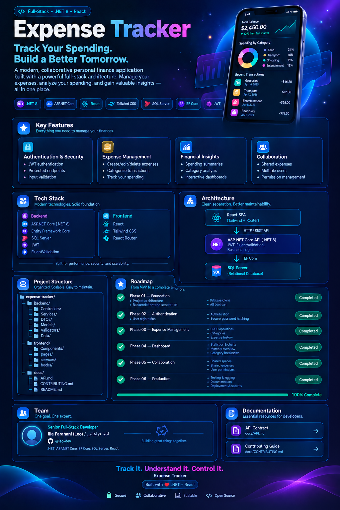
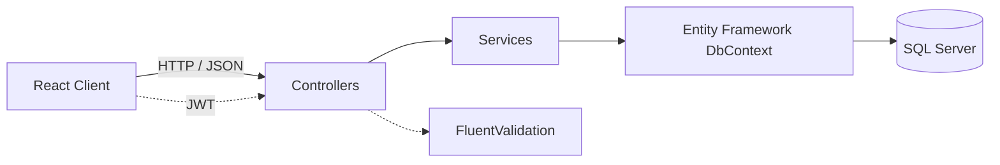

<!-- English Version -->

<div align="center">



<br />

</div>
<div align="center">

**[English](#-expense-tracker) | [فارسی](#-ردیاب-هزینه)**

# 💸 Expense Tracker

> **Take control of your money—one transaction at a time.**

A collaborative, security-focused personal finance application built with **ASP.NET Core 8** and **React**.


<br />

[](https://github.com/here-is-leo/expense-tracker/actions)
[](https://dotnet.microsoft.com/)
[](https://react.dev/)
[](https://www.microsoft.com/sql-server)
[](https://jwt.io/)
[](LICENSE)
[](CONTRIBUTING.md)


</div>

Expense Tracker is a full-stack portfolio project for securely recording, organizing, and understanding personal finances. It combines a practical layered backend with a modern frontend while deliberately avoiding unnecessary architectural complexity.

---

## 📚 Table of Contents

- [✨ Features](#-features)
- [🛠️ Tech Stack](#️-tech-stack)
- [🏗️ Architecture](#️-architecture)
- [📁 Project Structure](#-project-structure)
- [🚀 Getting Started](#-getting-started)
- [📖 API Documentation](#-api-documentation)
- [🔒 Security](#-security)
- [📸 Screenshots](#-screenshots)
- [🧪 Testing](#-testing)
- [🐳 Docker](#-docker)
- [🗺️ Roadmap](#️-roadmap)
- [👥 Meet the Team](#-meet-the-team)
- [🤝 Contributing](#-contributing)
- [📄 License](#-license)
- [🙏 Acknowledgements](#-acknowledgements)
- [🇮🇷 نسخه فارسی](#-ردیاب-هزینه)

---

## ✨ Features

### Backend

- ✅ User registration and login with JWT authentication
- ✅ Secure password hashing with BCrypt
- ✅ Transaction creation, reading, updating, and deletion
- ✅ Filtering by transaction type, category, date range, and search term
- ✅ Server-side pagination and sorting
- ✅ Eight seeded global categories: Food, Transport, Shopping, Bills, Entertainment, Health, Salary, and Other
- ✅ Dashboard aggregates for income, expenses, balance, categories, monthly trends, and recent transactions
- ✅ FluentValidation-powered request validation
- ✅ Centralized exception handling with a consistent error format
- ✅ Per-user ownership enforcement and IDOR prevention
- ✅ DTOs separated from persistence entities
- ✅ Layered Controllers → Services → DbContext design
- ⏳ Automated xUnit test suite planned

### Frontend

- ✅ React application powered by Vite
- ✅ Responsive interface styled with Tailwind CSS
- ✅ Client-side navigation with React Router
- ✅ Authentication and transaction-management workflows
- ✅ Dashboard presentation for financial summaries
- 🚧 Ongoing UI and accessibility refinement
- ⏳ Recharts-powered data visualizations planned

---

## 🛠️ Tech Stack

| Area | Technologies |
|---|---|
| **Backend** |     |
| **Frontend** |     |
| **Database** |  |
| **Authentication** |   |
| **Planned** |     |

---

## 🏗️ Architecture



```text
HTTP Request
     │
     ▼
Controllers ──► Services ──► EF Core DbContext ──► SQL Server
     │              │
     └─ DTOs        └─ Business rules and ownership checks
```

The application is a **modular layered monolith**. Controllers handle HTTP concerns, services contain application rules, and Entity Framework Core manages persistence.

The project intentionally avoids microservices, CQRS, and ceremony-heavy architecture. Its structure is straightforward, testable, and appropriate for the current scope while remaining easy to extend.

---

## 📁 Project Structure

```text
expense-tracker/
├── backend/
│   └── ExpenseTracker.Api/
│       ├── Controllers/
│       ├── Data/
│       ├── DTOs/
│       ├── Exceptions/
│       ├── Middleware/
│       ├── Models/
│       ├── Services/
│       ├── Validators/
│       ├── Program.cs
│       └── appsettings.json
├── frontend/
│   ├── public/
│   ├── src/
│   │   ├── components/
│   │   ├── pages/
│   │   ├── services/
│   │   ├── routes/
│   │   └── main.jsx
│   ├── package.json
│   └── vite.config.js
├── docs/
│   └── API.md
├── CONTRIBUTING.md
├── LICENSE
└── README.md
```

> The directory tree may evolve as the project grows. Check the repository for the current source layout.

---

## 🚀 Getting Started

The project can be developed on **Windows, macOS, or Linux**.

### Prerequisites

- [.NET 8 SDK](https://dotnet.microsoft.com/download/dotnet/8.0)
- [Node.js](https://nodejs.org/) with npm
- [SQL Server](https://www.microsoft.com/sql-server) or a compatible development instance
- Git
- Optional: Visual Studio, Rider, or VS Code

### 1. Clone the repository

```bash
git clone https://github.com/here-is-leo/expense-tracker.git
cd expense-tracker
```

### 2. Configure and run the backend

```bash
cd backend/ExpenseTracker.Api
dotnet restore
dotnet ef database update
dotnet run
```

Configure development values through `appsettings.Development.json`, environment variables, or .NET user secrets:

```json
{
  "ConnectionStrings": {
    "DefaultConnection": "Server=localhost;Database=ExpenseTrackerDb;Trusted_Connection=True;TrustServerCertificate=True"
  },
  "Jwt": {
    "Key": "replace-with-a-long-development-secret",
    "Issuer": "ExpenseTracker.Api",
    "Audience": "ExpenseTracker.Client"
  }
}
```

Example environment-variable equivalents:

```bash
ConnectionStrings__DefaultConnection="your-sql-server-connection-string"
Jwt__Key="your-long-random-secret"
Jwt__Issuer="ExpenseTracker.Api"
Jwt__Audience="ExpenseTracker.Client"
```

> Never commit production secrets. Use environment variables, user secrets, or a dedicated secrets manager.

### 3. Configure and run the frontend

```bash
cd ../../frontend
npm install
npm run dev
```

Create a local environment file when required:

```bash
VITE_API_BASE_URL=https://localhost:5001/api
```

Open the local address printed by Vite in your browser. Backend ports and frontend variable names may differ; use the values defined in the repository configuration.

---

## 📖 API Documentation

Detailed endpoint documentation is available in [`docs/API.md`](docs/API.md). During development, Swagger UI is exposed by the backend at its configured `/swagger` route.

| Method | Endpoint | Purpose |
|---|---|---|
| `POST` | `/api/auth/register` | Register a user |
| `POST` | `/api/auth/login` | Authenticate and receive a JWT |
| `GET` | `/api/transactions` | List, filter, sort, and paginate transactions |
| `GET` | `/api/transactions/{id}` | Retrieve one owned transaction |
| `POST` | `/api/transactions` | Create a transaction |
| `PUT` | `/api/transactions/{id}` | Update an owned transaction |
| `DELETE` | `/api/transactions/{id}` | Delete an owned transaction |
| `GET` | `/api/categories` | List global categories |
| `GET` | `/api/dashboard` | Retrieve financial aggregates and recent activity |

> Consult Swagger or `docs/API.md` for the exact request schemas, query parameters, and configured routes.

---

## 🔒 Security

- JWT-based authentication for protected API operations
- BCrypt password hashing; plaintext passwords are never stored
- Ownership checks on user-scoped resources to prevent IDOR vulnerabilities
- `404 Not Found` responses for inaccessible resources to avoid revealing their existence
- Server-side validation with FluentValidation
- Centralized exception handling and consistent error responses
- DTOs that prevent persistence entities from being exposed directly
- Fixed-precision `decimal`/`numeric(18,2)` values for monetary data
- UUID primary keys with sequential generation where configured

---

## 📸 Screenshots

<!-- Add dashboard screenshot here -->

<!-- Add transactions page screenshot here -->

<!-- Add authentication screens screenshot here -->

> Screenshots will be added as the user interface is finalized.

---

## 🧪 Testing

Manual API and end-to-end workflow verification currently covers authentication, ownership rules, validation, transaction CRUD, filtering, pagination, sorting, and dashboard calculations.

A repeatable **xUnit** suite is planned for service rules, validators, authorization boundaries, error handling, and API integration scenarios.

```bash
# Planned command once test projects are available
dotnet test
```

---

## 🐳 Docker

Docker support is **planned** and is not presented as production-ready yet.

Planned deliverables include backend and frontend Dockerfiles, SQL Server orchestration through Docker Compose, health checks, persistent database storage, and documented environment configuration.

```bash
# Planned workflow—not available until Docker configuration is added
docker compose up --build
```

---

## 🗺️ Roadmap

| Stage | Status | Scope |
|---|---:|---|
| **MVP** | ✅ | JWT authentication, BCrypt hashing, transaction CRUD, filters, pagination, sorting, categories, dashboard aggregates, validation, error handling, ownership enforcement, and layered organization |
| **Phase 2** | ⏳ | Recharts visualizations, automated xUnit coverage, accessibility refinements, Docker setup, and GitHub Actions CI |
| **Phase 3** | 🔮 | Budgets, recurring transactions, exports, richer analytics, notifications, deployment guidance, and broader customization |

- [x] Secure authentication
- [x] Transaction management
- [x] Search, filters, sorting, and pagination
- [x] Dashboard summaries
- [ ] Automated tests
- [ ] Interactive charts
- [ ] Dockerized development
- [ ] CI/CD pipeline
- [ ] Advanced budgeting tools

---

## 👥 Meet the Team

<div align="center">

<table>
<tr>
<td align="center" width="50%">
<a href="https://github.com/here-is-leo">

<br />
<strong>Ilia Farahani · ایلیا فراهانی</strong>
</a>
<br />
🧠 Backend & Architecture
<br />
<a href="https://github.com/here-is-leo">@here-is-leo</a>
<br /><br />
<em>“Reliable software begins with clear boundaries and thoughtful decisions.”</em>
</td>
<td align="center" width="50%">
<a href="https://github.com/taraneh-ghalandarii">

<br />
<strong>Taraneh Ghalandari · ترانه قلندری</strong>
</a>
<br />
🎨 Frontend & Design
<br />
<a href="https://github.com/taraneh-ghalandarii">@taraneh-ghalandarii</a>
<br /><br />
<em>“Great interfaces turn complex workflows into natural experiences.”</em>
</td>
</tr>
</table>

**Two disciplines, one shared goal: making personal finance simpler and safer.**

</div>

---

## 🤝 Contributing

Thoughtful contributions, bug reports, and improvement proposals are welcome. Read [`CONTRIBUTING.md`](CONTRIBUTING.md) before opening an issue or pull request.

Please keep changes focused, document new behavior, follow the existing architecture, and avoid presenting planned functionality as complete.

---

## 📄 License

This project is distributed under the **MIT License**. See [`LICENSE`](LICENSE) for the complete license text.

---

## 🙏 Acknowledgements

Thanks to the teams and communities behind ASP.NET Core, Entity Framework Core, React, Vite, Tailwind CSS, FluentValidation, BCrypt.Net, Swagger/OpenAPI, SQL Server, React Router, Recharts, xUnit, and the open-source tools that support this project.

<div align="center">

[](https://star-history.com/#here-is-leo/expense-tracker&Date)

If this project helps or inspires you, consider giving it a ⭐.

</div>

---

<!-- Persian Version -->

<div dir="rtl">

<div align="center">

# 💸 ردیاب هزینه

> **مدیریت پول را، تراکنش‌به‌تراکنش، در دست بگیرید.**

یک اپلیکیشن مشارکتی و امنیت‌محور برای مدیریت امور مالی شخصی، ساخته‌شده با **ASP.NET Core 8** و **React**.


<br />

[](https://github.com/here-is-leo/expense-tracker/actions)
[](https://dotnet.microsoft.com/)
[](https://react.dev/)
[](https://www.microsoft.com/sql-server)
[](https://jwt.io/)
[](LICENSE)
[](CONTRIBUTING.md)


</div>

Expense Tracker یک پروژه فول‌استک نمونه‌کار برای ثبت، سازمان‌دهی و تحلیل امن امور مالی شخصی است. این پروژه یک بک‌اند لایه‌بندی‌شده و کاربردی را با رابط کاربری مدرن ترکیب می‌کند و آگاهانه از پیچیدگی‌های معماری غیرضروری دور می‌ماند.

---

## 📚 فهرست مطالب

- [✨ قابلیت‌ها](#-قابلیت‌ها)
- [🛠️ فناوری‌های پروژه](#️-فناوری‌های-پروژه)
- [🏗️ معماری](#️-معماری)
- [📁 ساختار پروژه](#-ساختار-پروژه)
- [🚀 راه‌اندازی](#-راه‌اندازی)
- [📖 مستندات API](#-مستندات-api)
- [🔒 امنیت](#-امنیت)
- [📸 تصاویر](#-تصاویر)
- [🧪 آزمون‌ها](#-آزمون‌ها)
- [🐳 داکر](#-داکر)
- [🗺️ نقشه راه](#️-نقشه-راه)
- [👥 آشنایی با تیم](#-آشنایی-با-تیم)
- [🤝 مشارکت](#-مشارکت)
- [📄 مجوز](#-مجوز)
- [🙏 قدردانی](#-قدردانی)

---

## ✨ قابلیت‌ها

### بک‌اند

- ✅ ثبت‌نام و ورود کاربران با احراز هویت JWT
- ✅ هش امن گذرواژه‌ها با BCrypt
- ✅ ایجاد، مشاهده، ویرایش و حذف تراکنش‌ها
- ✅ فیلتر بر اساس نوع تراکنش، دسته‌بندی، بازه زمانی و عبارت جست‌وجو
- ✅ صفحه‌بندی و مرتب‌سازی در سمت سرور
- ✅ هشت دسته‌بندی عمومی اولیه: خوراک، حمل‌ونقل، خرید، قبوض، سرگرمی، سلامت، حقوق و سایر
- ✅ محاسبات داشبورد شامل درآمد، هزینه، موجودی، دسته‌بندی‌ها، روند ماهانه و تراکنش‌های اخیر
- ✅ اعتبارسنجی درخواست‌ها با FluentValidation
- ✅ مدیریت متمرکز خطاها با قالب پاسخ یکپارچه
- ✅ کنترل مالکیت داده‌ها برای هر کاربر و جلوگیری از IDOR
- ✅ جداسازی DTOها از موجودیت‌های پایگاه داده
- ✅ طراحی لایه‌ای Controllers → Services → DbContext
- ⏳ مجموعه آزمون‌های خودکار xUnit در برنامه توسعه

### فرانت‌اند

- ✅ اپلیکیشن React مبتنی بر Vite
- ✅ رابط واکنش‌گرا با Tailwind CSS
- ✅ مسیریابی سمت کاربر با React Router
- ✅ فرایندهای احراز هویت و مدیریت تراکنش
- ✅ نمایش خلاصه اطلاعات مالی در داشبورد
- 🚧 بهبود مستمر رابط کاربری و دسترس‌پذیری
- ⏳ نمودارهای داده با Recharts در برنامه توسعه

---

## 🛠️ فناوری‌های پروژه

| بخش | فناوری‌ها |
|---|---|
| **بک‌اند** |     |
| **فرانت‌اند** |     |
| **پایگاه داده** |  |
| **احراز هویت** |   |
| **برنامه‌ریزی‌شده** |     |

---

## 🏗️ معماری


```text
درخواست HTTP
     │
     ▼
Controllers ──► Services ──► EF Core DbContext ──► SQL Server
     │              │
     └─ DTOها       └─ قوانین کسب‌وکار و کنترل مالکیت
```

این برنامه یک **مونولیت ماژولار و لایه‌بندی‌شده** است. کنترلرها مسئول مفاهیم HTTP، سرویس‌ها محل اجرای قوانین برنامه و Entity Framework Core مسئول دسترسی به داده‌ها است.

پروژه عمداً از میکروسرویس، CQRS و معماری‌های تشریفاتی و سنگین استفاده نمی‌کند. ساختار فعلی شفاف، آزمون‌پذیر، متناسب با ابعاد پروژه و در عین حال قابل توسعه است.

---

## 📁 ساختار پروژه

```text
expense-tracker/
├── backend/
│   └── ExpenseTracker.Api/
│       ├── Controllers/
│       ├── Data/
│       ├── DTOs/
│       ├── Exceptions/
│       ├── Middleware/
│       ├── Models/
│       ├── Services/
│       ├── Validators/
│       ├── Program.cs
│       └── appsettings.json
├── frontend/
│   ├── public/
│   ├── src/
│   │   ├── components/
│   │   ├── pages/
│   │   ├── services/
│   │   ├── routes/
│   │   └── main.jsx
│   ├── package.json
│   └── vite.config.js
├── docs/
│   └── API.md
├── CONTRIBUTING.md
├── LICENSE
└── README.md
```

> ممکن است این ساختار هم‌زمان با توسعه پروژه تغییر کند. برای مشاهده ساختار فعلی، مخزن پروژه را بررسی کنید.

---

## 🚀 راه‌اندازی

امکان توسعه پروژه روی **ویندوز، macOS و لینوکس** وجود دارد.

### پیش‌نیازها

- [.NET 8 SDK](https://dotnet.microsoft.com/download/dotnet/8.0)
- [Node.js](https://nodejs.org/) به همراه npm
- [SQL Server](https://www.microsoft.com/sql-server) یا یک نمونه سازگار برای توسعه
- Git
- در صورت تمایل: Visual Studio، Rider یا VS Code

### ۱. دریافت پروژه

```bash
git clone https://github.com/here-is-leo/expense-tracker.git
cd expense-tracker
```

### ۲. پیکربندی و اجرای بک‌اند

```bash
cd backend/ExpenseTracker.Api
dotnet restore
dotnet ef database update
dotnet run
```

مقادیر محیط توسعه را از طریق `appsettings.Development.json`، متغیرهای محیطی یا User Secrets دات‌نت تنظیم کنید:

```json
{
  "ConnectionStrings": {
    "DefaultConnection": "Server=localhost;Database=ExpenseTrackerDb;Trusted_Connection=True;TrustServerCertificate=True"
  },
  "Jwt": {
    "Key": "replace-with-a-long-development-secret",
    "Issuer": "ExpenseTracker.Api",
    "Audience": "ExpenseTracker.Client"
  }
}
```

نمونه متغیرهای محیطی معادل:

```bash
ConnectionStrings__DefaultConnection="your-sql-server-connection-string"
Jwt__Key="your-long-random-secret"
Jwt__Issuer="ExpenseTracker.Api"
Jwt__Audience="ExpenseTracker.Client"
```

> اسرار محیط عملیاتی را هرگز در مخزن ثبت نکنید. از متغیرهای محیطی، User Secrets یا سامانه مدیریت اسرار استفاده کنید.

### ۳. پیکربندی و اجرای فرانت‌اند

```bash
cd ../../frontend
npm install
npm run dev
```

در صورت نیاز، فایل محیط محلی را ایجاد کنید:

```bash
VITE_API_BASE_URL=https://localhost:5001/api
```

آدرسی را که Vite در ترمینال نمایش می‌دهد در مرورگر باز کنید. پورت بک‌اند و نام متغیر فرانت‌اند ممکن است متفاوت باشد؛ مقادیر موجود در پیکربندی مخزن را ملاک قرار دهید.

---

## 📖 مستندات API

مستندات کامل endpointها در فایل [`docs/API.md`](docs/API.md) قرار دارد. هنگام توسعه، رابط Swagger از مسیر پیکربندی‌شده `/swagger` در بک‌اند در دسترس است.

| متد | مسیر | کاربرد |
|---|---|---|
| `POST` | `/api/auth/register` | ثبت‌نام کاربر |
| `POST` | `/api/auth/login` | ورود و دریافت JWT |
| `GET` | `/api/transactions` | دریافت، فیلتر، مرتب‌سازی و صفحه‌بندی تراکنش‌ها |
| `GET` | `/api/transactions/{id}` | دریافت یک تراکنش متعلق به کاربر |
| `POST` | `/api/transactions` | ایجاد تراکنش |
| `PUT` | `/api/transactions/{id}` | ویرایش تراکنش متعلق به کاربر |
| `DELETE` | `/api/transactions/{id}` | حذف تراکنش متعلق به کاربر |
| `GET` | `/api/categories` | دریافت دسته‌بندی‌های عمومی |
| `GET` | `/api/dashboard` | دریافت محاسبات مالی و فعالیت‌های اخیر |

> برای مشاهده مسیرهای قطعی، پارامترهای جست‌وجو و ساختار درخواست‌ها به Swagger یا `docs/API.md` مراجعه کنید.

---

## 🔒 امنیت

- احراز هویت مبتنی بر JWT برای عملیات محافظت‌شده API
- هش گذرواژه با BCrypt؛ گذرواژه خام ذخیره نمی‌شود
- کنترل مالکیت منابع کاربر برای جلوگیری از آسیب‌پذیری IDOR
- پاسخ `404 Not Found` برای منابع غیرقابل‌دسترسی به‌منظور پنهان‌ماندن وجود آن‌ها
- اعتبارسنجی سمت سرور با FluentValidation
- مدیریت متمرکز استثناها و پاسخ خطای یکپارچه
- استفاده از DTO برای جلوگیری از نمایش مستقیم موجودیت‌های پایگاه داده
- استفاده از `decimal` و `numeric(18,2)` با دقت ثابت برای مقادیر مالی
- کلیدهای اصلی UUID با تولید ترتیبی در بخش‌های پیکربندی‌شده

---

## 📸 تصاویر

<!-- تصویر داشبورد در این بخش اضافه شود -->

<!-- تصویر صفحه تراکنش‌ها در این بخش اضافه شود -->

<!-- تصویر صفحات ورود و ثبت‌نام در این بخش اضافه شود -->

> تصاویر پس از نهایی‌شدن رابط کاربری اضافه خواهند شد.

---

## 🧪 آزمون‌ها

در حال حاضر فرایندهای احراز هویت، کنترل مالکیت، اعتبارسنجی، عملیات CRUD تراکنش‌ها، فیلتر، صفحه‌بندی، مرتب‌سازی و محاسبات داشبورد به‌صورت دستی و در جریان‌های کامل برنامه بررسی می‌شوند.

ایجاد مجموعه آزمون‌های تکرارپذیر با **xUnit** برای قوانین سرویس‌ها، اعتبارسنج‌ها، مرزهای دسترسی، مدیریت خطا و سناریوهای یکپارچه API برنامه‌ریزی شده است.

```bash
# فرمان برنامه‌ریزی‌شده پس از اضافه‌شدن پروژه‌های آزمون
dotnet test
```

---

## 🐳 داکر

پشتیبانی از Docker **برنامه‌ریزی شده** و هنوز به‌عنوان قابلیت آماده محیط عملیاتی معرفی نمی‌شود.

موارد برنامه‌ریزی‌شده شامل Dockerfile برای بک‌اند و فرانت‌اند، اجرای SQL Server با Docker Compose، بررسی سلامت سرویس‌ها، ذخیره پایدار داده‌ها و مستندسازی متغیرهای محیطی است.

```bash
# فرایند برنامه‌ریزی‌شده؛ تا زمان اضافه‌شدن تنظیمات Docker قابل استفاده نیست
docker compose up --build
```

---

## 🗺️ نقشه راه

| مرحله | وضعیت | محدوده |
|---|---:|---|
| **نسخه اولیه MVP** | ✅ | احراز هویت JWT، هش BCrypt، مدیریت تراکنش، فیلتر، صفحه‌بندی، مرتب‌سازی، دسته‌بندی‌ها، داشبورد، اعتبارسنجی، مدیریت خطا، کنترل مالکیت و ساختار لایه‌ای |
| **مرحله دوم** | ⏳ | نمودارهای Recharts، آزمون‌های xUnit، بهبود دسترس‌پذیری، راه‌اندازی Docker و CI با GitHub Actions |
| **مرحله سوم** | 🔮 | بودجه‌بندی، تراکنش‌های دوره‌ای، خروجی داده، تحلیل‌های پیشرفته، اعلان‌ها، راهنمای استقرار و شخصی‌سازی گسترده‌تر |

- [x] احراز هویت امن
- [x] مدیریت تراکنش‌ها
- [x] جست‌وجو، فیلتر، مرتب‌سازی و صفحه‌بندی
- [x] خلاصه‌های داشبورد
- [ ] آزمون‌های خودکار
- [ ] نمودارهای تعاملی
- [ ] محیط توسعه مبتنی بر Docker
- [ ] خط لوله CI/CD
- [ ] ابزارهای پیشرفته بودجه‌بندی

---

## 👥 آشنایی با تیم

<div align="center">

<table>
<tr>
<td align="center" width="50%">
<a href="https://github.com/here-is-leo">

<br />
<strong>ایلیا فراهانی · Ilia Farahani</strong>
</a>
<br />
🧠 بک‌اند و معماری
<br />
<a href="https://github.com/here-is-leo">@here-is-leo</a>
<br /><br />
<em>«نرم‌افزار قابل‌اعتماد از مرزبندی روشن و تصمیم‌های سنجیده آغاز می‌شود.»</em>
</td>
<td align="center" width="50%">
<a href="https://github.com/taraneh-ghalandarii">

<br />
<strong>ترانه قلندری · Taraneh Ghalandari</strong>
</a>
<br />
🎨 فرانت‌اند و طراحی
<br />
<a href="https://github.com/taraneh-ghalandarii">@taraneh-ghalandarii</a>
<br /><br />
<em>«یک رابط کاربری خوب، فرایندهای پیچیده را به تجربه‌ای طبیعی تبدیل می‌کند.»</em>
</td>
</tr>
</table>

**دو تخصص، یک هدف مشترک: ساده‌تر و امن‌تر کردن مدیریت مالی شخصی.**

</div>

---

## 🤝 مشارکت

از مشارکت‌های هدفمند، گزارش خطا و پیشنهادهای بهبود استقبال می‌کنیم. پیش از ایجاد Issue یا Pull Request، فایل [`CONTRIBUTING.md`](CONTRIBUTING.md) را مطالعه کنید.

لطفاً تغییرات را متمرکز نگه دارید، رفتارهای جدید را مستند کنید، از معماری موجود پیروی کنید و قابلیت‌های برنامه‌ریزی‌شده را تکمیل‌شده معرفی نکنید.

---

## 📄 مجوز

این پروژه تحت **مجوز MIT** منتشر شده است. متن کامل مجوز در فایل [`LICENSE`](LICENSE) قرار دارد.

---

## 🙏 قدردانی

از تیم‌ها و جامعه‌های توسعه‌دهنده ASP.NET Core، Entity Framework Core، React، Vite، Tailwind CSS، FluentValidation، BCrypt.Net، Swagger/OpenAPI، SQL Server، React Router، Recharts، xUnit و تمام ابزارهای متن‌بازی که توسعه این پروژه را ممکن کرده‌اند سپاسگزاریم.

<div align="center">

[](https://star-history.com/#here-is-leo/expense-tracker&Date)

اگر این پروژه برای شما مفید یا الهام‌بخش بود، خوشحال می‌شویم یک ⭐ به آن بدهید.

</div>

</div>
